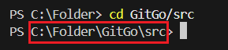
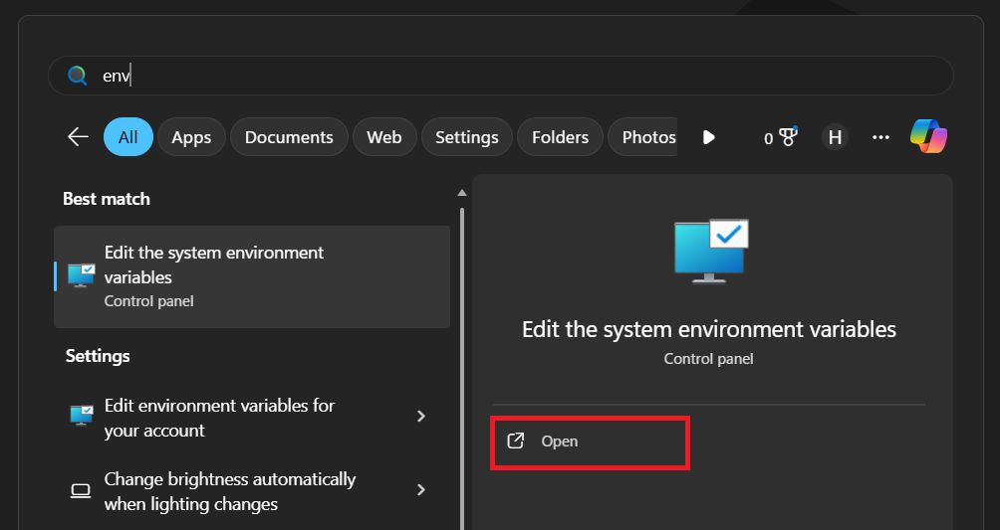
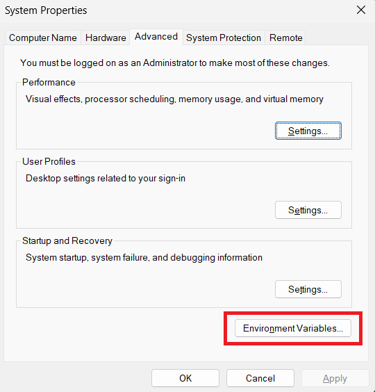
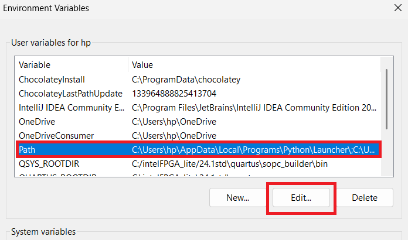
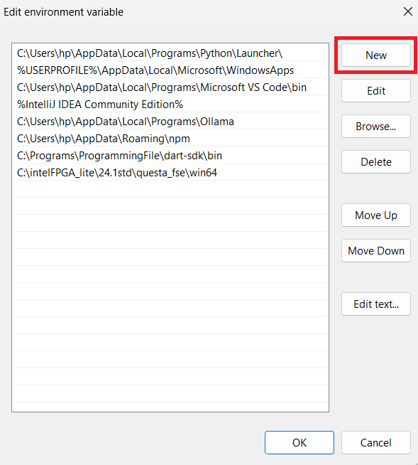
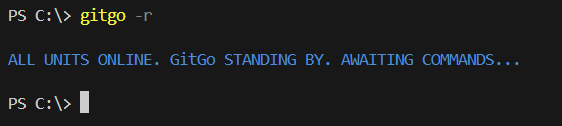

<div align="center">

# 🚀 GitGo

**A Powerful Git Workflow Automation Tool**

[](https://opensource.org/licenses/MIT)
[](https://www.python.org/downloads/)
[](https://www.microsoft.com/windows)
[](https://git-scm.com/)

*Streamline your Git workflow with intelligent automation and save valuable development time*

</div>

---

## 📋 Table of Contents

- [✨ Features](#-features)
- [🎯 What GitGo Does](#-what-gitgo-does)
- [📋 Prerequisites](#-prerequisites)
- [🛠️ Installation](#️-installation)
- [🚀 Quick Start](#-quick-start)
- [📖 Usage Guide](#-usage-guide)
- [🖼️ Visual Setup Guide](#️-visual-setup-guide)
- [🤝 Contributing](#-contributing)
- [👥 Collaborators](#-collaborators)
- [📄 License](#-license)
- [🆘 Support](#-support)

---

## ✨ Features

<div align="center">

| Feature | Description |
|---------|-------------|
| 🔄 **Automated Push** | Streamlined commit and push operations in one command |
| 🌿 **Branch Management** | Create and switch to new branches effortlessly |
| 🎨 **Colored Output** | Beautiful terminal feedback with status indicators |
| ⚡ **Time-Saving** | Reduce repetitive Git operations to single commands |
| 🛡️ **Error Handling** | Robust error detection and user-friendly messages |
| 🎯 **Mission-Style UI** | Engaging command-line interface with tactical feedback |

</div>

## 🎯 What GitGo Does

GitGo transforms complex Git workflows into simple, one-line commands. Instead of running multiple Git commands manually:

```bash
# Traditional way
git add .
git commit -m "Your commit message"
git push -u origin main
```

**With GitGo, just run:**
```bash
gitgo push main "Your commit message"
```

---

## 📋 Prerequisites

Before installing GitGo, ensure you have:

<div align="center">

| Requirement | Version | Download |
|-------------|---------|----------|
| 🐍 **Python** | 3.6+ | [Download Python](https://www.python.org/downloads/) |
| 📦 **Git** | 2.x+ | [Download Git](https://git-scm.com/downloads) |
| 💻 **Windows** | 10/11 | [Windows Terminal](https://aka.ms/terminal) (Recommended) |

</div>

---

## 🛠️ Installation

### Step 1: Clone the Repository

```powershell
git clone https://github.com/Huerte/GitGo.git
cd GitGo
```

### Step 2: Navigate to Source Directory

```powershell
cd src
```

### Step 3: Copy the Working Directory Path

Copy the full path to the `src` directory. You'll need this for the environment setup.

<div align="center">

</div>

---

## 🖼️ Visual Setup Guide

### 🔧 Setting Up Environment Variables

<details>
<summary><strong>📸 Click to expand visual guide</strong></summary>

#### 1. Access Environment Variables Settings
Press `Windows + R`, type `sysdm.cpl`, and press Enter. Or search for "environment variables" in Start menu.

<div align="center">

</div>

#### 2. Open Environment Variables Dialog
Click on "Environment Variables" button in the System Properties window.

<div align="center">

</div>

#### 3. Edit System Path Variable
Find "Path" in System Variables, select it, and click "Edit".

<div align="center">

</div>

#### 4. Add GitGo Path
Click "New" and paste your GitGo src directory path.

<div align="center">

</div>

#### 5. Verify Installation
Open a new PowerShell window and test the installation:

```powershell
gitgo -r
```

<div align="center">

</div>

</details>

---

## 🚀 Quick Start

Once installed, verify GitGo is working:

```powershell
# Check if GitGo is ready
gitgo -r
# Output: ALL UNITS ONLINE. GitGo STANDING BY. AWAITING COMMANDS...
```

### Your First GitGo Command

```powershell
# Make some changes to your project, then:
gitgo push main "Initial commit with GitGo"
```

**GitGo will automatically:**
1. ✅ Stage all changes (`git add .`)
2. ✅ Commit with your message
3. ✅ Push to the specified branch
4. ✅ Display mission completion status

---

## 📖 Usage Guide

### 🎯 Command Reference

| Command | Description | Example |
|---------|-------------|---------|
| `gitgo -r` | Check GitGo status | `gitgo -r` |
| `gitgo push [branch] [message]` | Commit and push to existing branch | `gitgo push main "Fix bug"` |
| `gitgo push -n [branch] [message]` | Create new branch and push | `gitgo push -n feature "New feature"` |
| `gitgo help` | Show help information | `gitgo help` |

### 💡 Pro Tips

- **Branch Creation**: Use `-n` or `new` to create and switch to a new branch
- **Commit Messages**: Always include meaningful commit messages
- **Status Check**: Run `gitgo -r` to ensure everything is configured correctly

### 🎨 Output Examples

**Successful Operation:**
```
✅ MISSION COMPLETE — NO CASUALTIES. ALL TARGETS NEUTRALIZED.
AWAITING FOR YOUR NEXT ORDERS.
```

**Ready Status:**
```
🔵 ALL UNITS ONLINE. GitGo STANDING BY. AWAITING COMMANDS...
```

---

## 🤝 Contributing

We welcome contributions from the community! Here's how you can help:

### 🌟 Ways to Contribute

- 🐛 **Report Bugs** - Found an issue? Let us know!
- 💡 **Suggest Features** - Have ideas for improvements?
- 📝 **Improve Documentation** - Help make our docs better
- 🔧 **Submit Code** - Fix bugs or add new features

### 📋 Contribution Process

1. **Fork** the repository
2. **Create** a feature branch (`git checkout -b feature/amazing-feature`)
3. **Commit** your changes (`git commit -m 'Add amazing feature'`)
4. **Push** to the branch (`git push origin feature/amazing-feature`)
5. **Open** a Pull Request

---

## 👥 Collaborators

<div align="center">

### 🚀 Meet the Team Behind GitGo

<table>
<tr>
<td align="center">
<a href="https://github.com/Huerte">

<br />
<sub><b>Huerte</b></sub>
</a>
<br />
<a href="https://github.com/Huerte" title="Profile">🔗 Profile</a>
</td>
<td align="center">
<a href="https://github.com/Venomous-pie">

<br />
<sub><b>Venomous-pie</b></sub>
</a>
<br />
<a href="https://github.com/Venomous-pie" title="Profile">🔗 Profile</a>
</td>
</tr>
</table>

*Special thanks to our collaborators for their dedication and expertise in creating this powerful Git automation tool.*

</div>

---

## 📄 License

This project is licensed under the **MIT License** - see the [LICENSE](LICENSE) file for details.

```
MIT License - Feel free to use, modify, and distribute this software.
```

---

## 🆘 Support

<div align="center">

### Need Help? We've Got You Covered!

</div>

If you encounter any issues or have questions:

### 📞 Support Channels

1. **📚 Documentation** - Check this README and inline help (`gitgo help`)
2. **🐛 GitHub Issues** - [Open an issue](https://github.com/Huerte/GitGo/issues) for bugs or feature requests
3. **💬 Discussions** - Join our [GitHub Discussions](https://github.com/Huerte/GitGo/discussions)
4. **📧 Direct Contact** - Reach out to the maintainers

### 🔍 Troubleshooting

**Common Issues:**

| Problem | Solution |
|---------|----------|
| `gitgo` command not found | Close current terminal and open a new one after PATH setup |
| Permission errors | Run PowerShell as Administrator |
| Git errors | Verify you're in a Git repository |

---

<div align="center">

### ⭐ Star this repository if GitGo helped streamline your workflow!

**Made with ❤️ by the GitGo Team**

[⬆ Back to Top](#-gitgo)

</div>
