# Your First Contribution to GitGo

This guide covers every step from setting up the code on your computer to submitting a pull request. It assumes you've never done this before, and that's fine.

If something doesn't work as described, open an issue and ask.

---

## What You Need

Before starting, make sure you have these installed:

- **Python 3.8 or newer**
- **Git**: download at [git-scm.com](https://git-scm.com) if you don't have it
- **A GitHub account**: free at [github.com](https://github.com)

## Step 1: Fork the Project

A fork is your own personal copy of the GitGo repository on GitHub. You need it because you can't push code directly to the main repo.

**1.** Go to [github.com/Huerte/GitGo](https://github.com/Huerte/GitGo).

This is the main project page. Look for the **Fork** button near the top right.

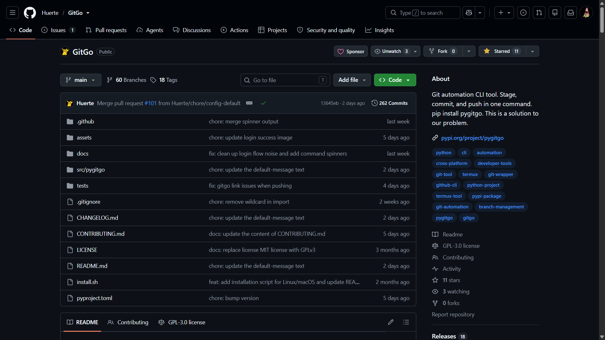

**2.** Click the **Fork** button. It's in the top-right area of the page, next to the Star and Watch buttons.

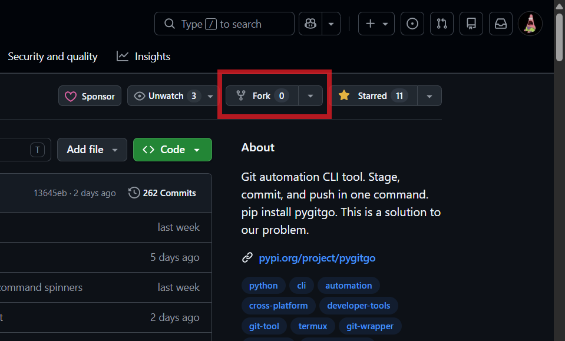

**3.** GitHub will show a short form asking where to put the fork. You don't need to change anything. The owner should already be set to your own username. Click **Create fork**.

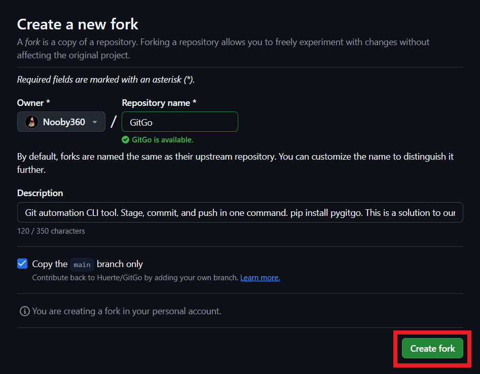

After a few seconds, GitHub redirects you to your own copy of the repo. You can tell it's yours because the URL and the top-left heading will say `YOUR_USERNAME/GitGo`, not `Huerte/GitGo`. Keep this page open. You'll use it in the next step.

## Step 2: Clone to Your Computer

Cloning downloads the repository from GitHub to your local machine so you can edit the files.

**1.** On your fork page, click the green **Code** button. It opens a small dropdown with a URL.

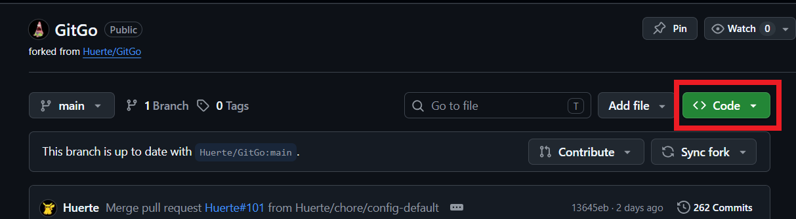

**2.** Copy the HTTPS URL shown there. It'll look like `https://github.com/YOUR_USERNAME/GitGo.git`.

Make sure you're copying from **your fork**, not from the original `Huerte/GitGo` repo.

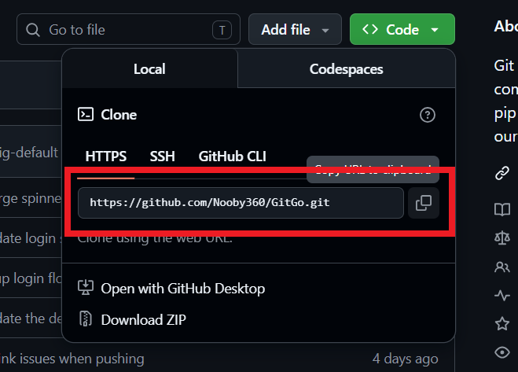

**3.** Open your terminal and run:

```bash
git clone https://github.com/YOUR_USERNAME/GitGo.git
```

Replace `YOUR_USERNAME` with your actual GitHub username.

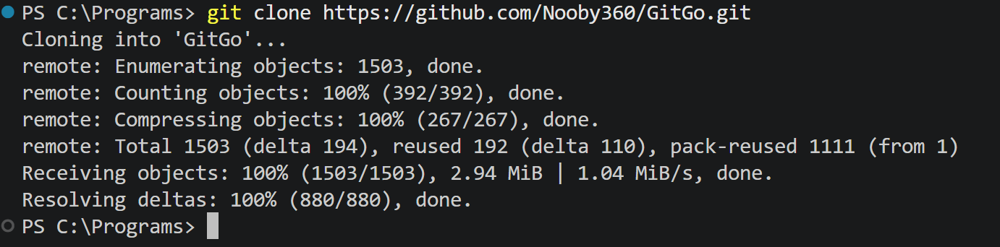

**4.** Move into the folder that was just created:

```bash
cd GitGo
```

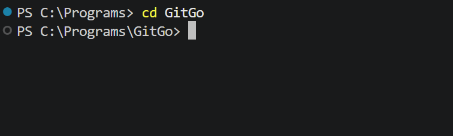

**5.** Add the original repository as the upstream remote. This lets you pull in future updates from the main project without affecting your fork.

```bash
git remote add upstream https://github.com/Huerte/GitGo.git
```

## Step 3: Set Up the Code

Make sure your terminal is still inside the `GitGo` folder. If you reopened it, run `cd GitGo` first.

Run this command to install the project in editable mode:

```bash
pip install -e ".[dev]"
```

The `-e` flag means "editable." Any code change you make takes effect immediately without reinstalling. The `[dev]` part installs the extra tools you need to run tests.

Then verify it worked:

```bash
gitgo -r
```

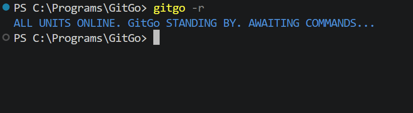

The `-r` flag checks that GitGo is ready to run. You should see a short status message with no errors.

> **Important:** Before moving to the next step, make sure you have connected GitGo to your GitHub account. If you haven't done this yet, run `gitgo user login` and follow the [Login Guide](login-guide.md) first.

## Step 4: Pick a Task

You have two places to find something to work on.

**Option A: The Good First Issues table in CONTRIBUTING.md**

The [Good First Issues](../CONTRIBUTING.md#good-first-issues) table is curated directly in the repo. Each entry has a difficulty rating, a starting file, and a clear description of what to build. This is the best place to start if you want a task that's already been thought through.

**Option B: The GitHub Issues tab**

You can also browse the [open issues](https://github.com/Huerte/GitGo/issues) on GitHub. Filter by the `good first issue` label to narrow it down.

**Claiming the issue**

Once you pick an issue from the table or the Issues tab, click its title to open the full issue page on GitHub. Scroll to the very bottom to find the comment box. Leave a short comment to let others know you're working on it. Something like "I would like to work on this!" is enough.

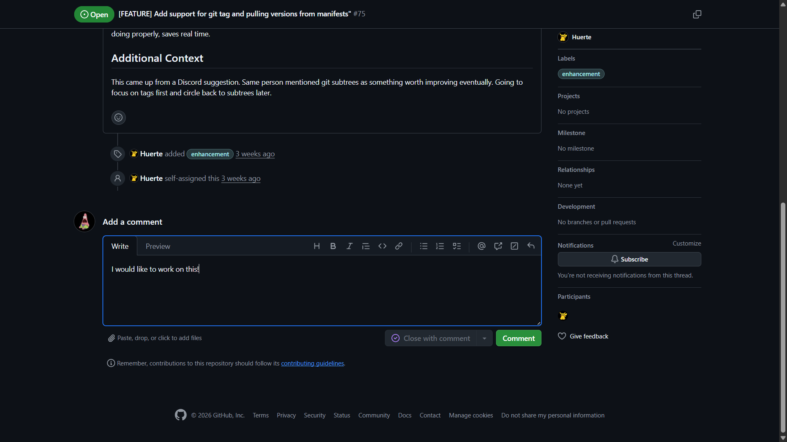

## Step 5: Create a Branch

A branch is a separate copy of the code inside your local repo. It keeps your changes isolated from the main code until they're reviewed and accepted.

Run this command to create a new branch and switch to it:

```bash
git checkout -b feat/your-feature-name
```

Name it using one of our prefixes (`feat/`, `fix/`, `docs/`, or `chore/`) based on what you're doing. For example: `feat/log-command`, `fix/readme-typo`, or `docs/first-contribution`.

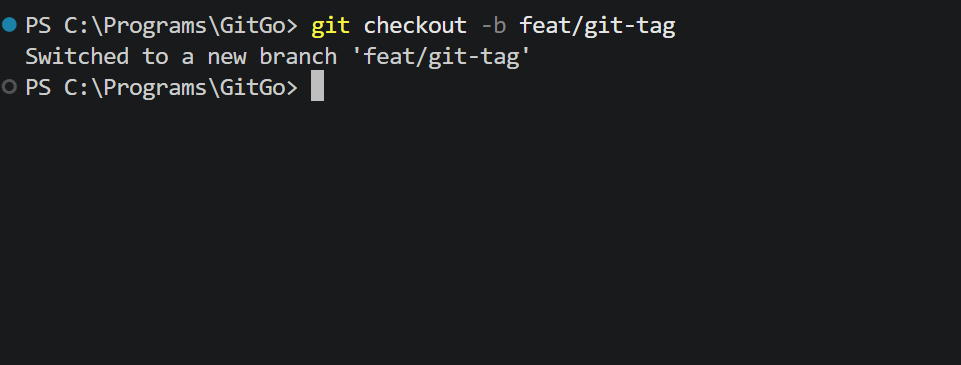

## Step 6: Make Your Change

Open the project in any editor you prefer. VS Code, Vim, Nano, whatever works for you.

Find the file you need, make your edits, and save. To see which files you've changed, run:

```bash
git status
```

Modified files show up in red. Staged files show up in green. (If your terminal doesn't show colors, look for the file names under "Changes not staged for commit" or "Changes to be committed".)

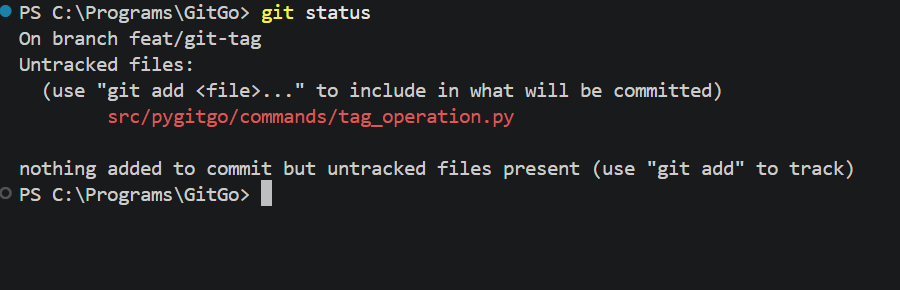

## Step 7: Commit and Push

Once your change is working, you need to save it (commit) and send it to your GitHub fork (push).

**Stage your files.** This tells Git which changes to include:

```bash
git add .
```

**Create a commit.** Write a short message describing what you changed. (The `fix:` prefix is a commit convention. See [Commit Messages](../CONTRIBUTING.md#commit-messages) for the full list.)

```bash
git commit -m "fix: corrected the spelling in README"
```

**Push to your fork.** This sends your branch up to GitHub. (The `-u` flag tells Git to remember this branch and remote. After the first push, you can run `git push` without `-u`.)

```bash
git push -u origin feat/your-feature-name
```

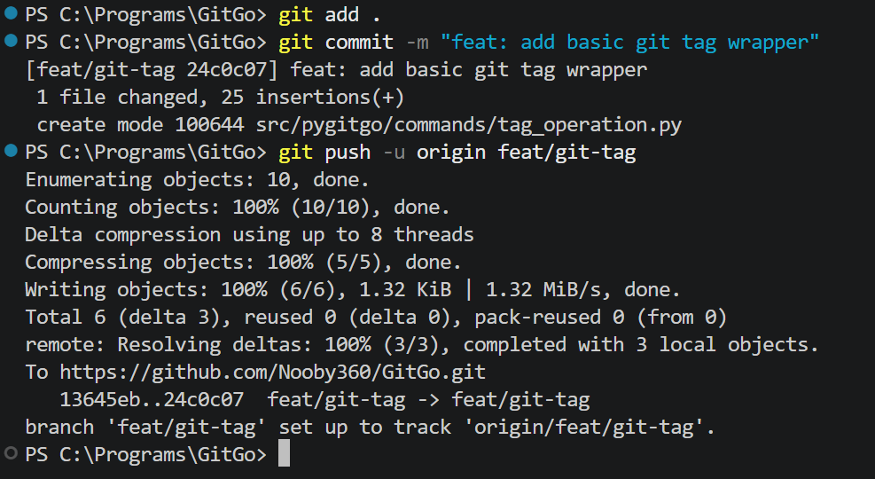

> [!TIP]
> **The GitGo Advantage**
>
> Those three commands above can be replaced with one:
> ```bash
> gitgo push feat/your-feature-name "fix: corrected the spelling in README"
> ```
> GitGo stages, commits, and pushes in one shot.
>
> 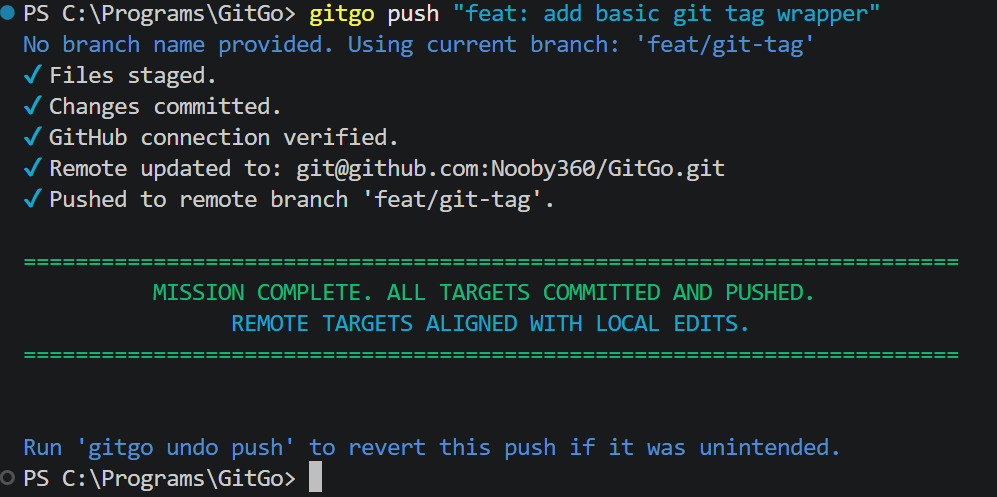

## Step 8: Open a Pull Request

A pull request (PR) is how you ask the maintainer to merge your changes into the main project.

**1.** Go back to your fork page on GitHub. You'll see a yellow banner at the top that appeared after you pushed your branch.

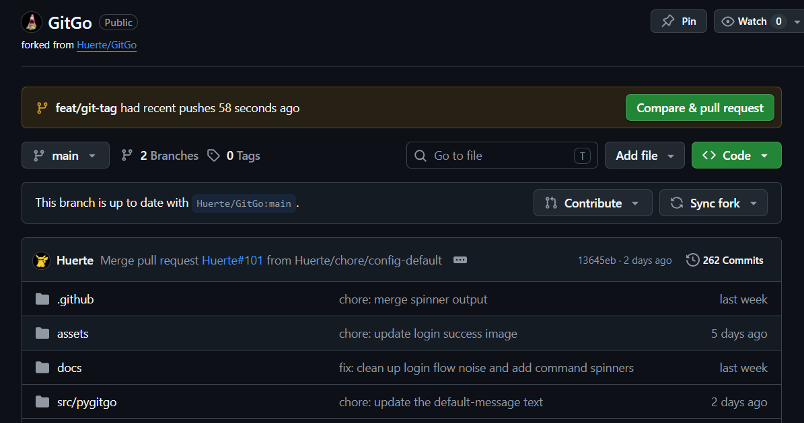

**2.** Click the **Compare & pull request** button on that banner.

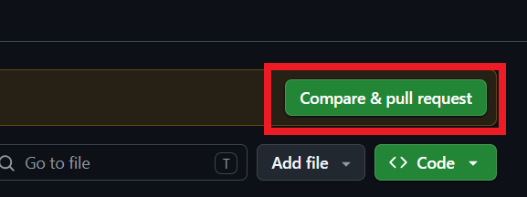

**3.** Fill in the title and description. Our repository uses a Pull Request template that automatically appears in the text box. Fill it out by putting an `x` inside the brackets for the checkboxes (like `[x]`), and writing `Closes #75` (use the actual issue number) to link it to the issue you claimed.

In the Changes section, list what you added or fixed as bullet points. For example: `- Fixed spelling in README.md`.

Keep the title short and direct, like `feat: add basic git tag wrapper`.

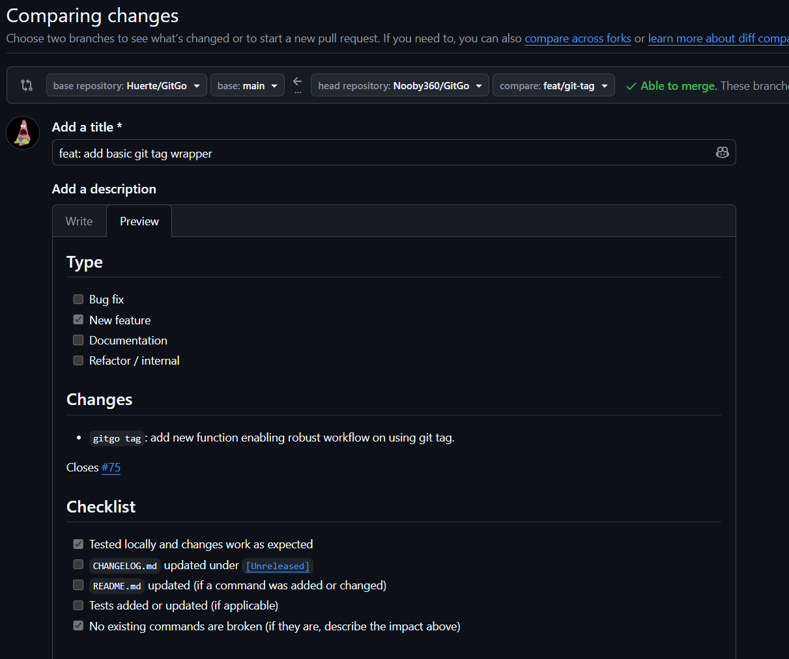

**4.** Click the green **Create pull request** button.

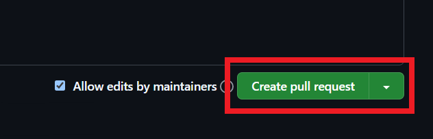

## Step 9: What Happens Next

A maintainer will read through your code and may leave comments asking for changes. That's a normal part of the process, not a rejection.

If changes are requested, edit the files on your computer, then run the add, commit, and push steps again (or use `gitgo push`). The PR updates automatically, no need to close and reopen it.

For deeper information about the project structure, test conventions, and code style, read the full [Contributing Guide](../CONTRIBUTING.md). If you run into any errors along the way, the [Troubleshooting Guide](troubleshooting.md) covers the most common ones.
