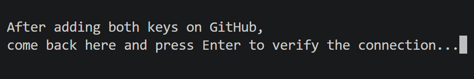

# Login Guide: `gitgo user login`

This guide walks you through connecting GitGo to your GitHub account. You only need to do this **once** on each computer you use.

---

## Before You Start

Make sure you have:

- GitGo installed. Run `gitgo -r` to check. It should not show any errors.
- A GitHub account. If you don't have one, create it at [github.com](https://github.com).
- OpenSSH installed. On most computers, this is already present by default.

---

## What Happens When You Run the Command

GitGo does these things for you:

1. Checks if you are already connected to GitHub
2. Asks for your GitHub email address
3. Generates an SSH key tied to that email
4. Displays the public key for you to copy
5. Waits for you to copy it, then opens GitHub in your browser
6. Waits for you to add both keys on GitHub, then presses Enter to verify
7. Tests the SSH connection
8. Sets up your Git name and email from your GitHub account

You will add the same key **twice** on GitHub: once as an **Authentication Key** (for pushing and pulling), and once as a **Signing Key** (so your commits show a **Verified** badge). Both entries use the exact same key text.

---

## Step-by-Step

### Step 1: Run the command

Open your terminal and run:

```bash
gitgo user login
```

GitGo first checks if your computer is already connected to GitHub via SSH.

**Already logged in via a GitGo-managed key:**
GitGo confirms the connection, configures SSH commit signing, and sets up your Git identity. No further steps needed.


**Connected via a key GitGo did not create:**
GitGo warns you that it cannot manage this connection. To get SSH signing and verified commits through GitGo, you need to log out first:

```bash
gitgo user logout
gitgo user login
```

**Not connected at all:**
GitGo shows `✖ Not connected to GitHub.` followed by `Initiating login sequence...` and moves on to Step 2.

---

### Step 2: Type your GitHub email

GitGo asks for your GitHub email address.

```
Enter your email for GitHub:
```


Type the email you used when you signed up on GitHub, then press Enter. GitGo validates the format before moving on. If it doesn't look like a valid email, it will ask again.

---

### Step 3: Copy the key that appears

After generating your SSH key, GitGo prints:


Select and copy the entire line starting with `ssh-ed25519`. Include the email at the end. That single line is your complete public key.

> **Note:** If you see a warning about the SSH agent not running, you can ignore it for now and continue. The login flow will still complete. See [Troubleshooting](#troubleshooting) if the final verification step fails.

---

### Step 4: Press Enter to open GitHub

GitGo tells you to add the key twice, and waits for you to press Enter:

```
Copy the key above, then add it TWICE on GitHub:
  1. Authentication Key  (for pushing and pulling)
  2. Signing Key         (for Verified commits)
Same key text for both entries.

Once you've copied the key, press Enter to open GitHub...
```

GitGo opens the GitHub SSH key form directly in your browser. If the browser does not open automatically, a fallback URL will be printed in the terminal for you to visit manually.

---

### Step 5: Add the key on GitHub (Authentication)

Fill in the form like this:

| Field | What to put |
|-------|-------------|
| **Title** | *(Optional)* A short label for this computer. For example: `My Laptop` |
| **Key type** | Choose **Authentication Key** |
| **Key** | Paste the key you copied in Step 3 |

Then click **Add SSH key**.


> *Make sure Key type is set to Authentication Key before clicking Add SSH key.*

---

### Step 6: Add the same key again (Signing)

Click **New SSH key** on the GitHub SSH settings page again.

> This is a second, separate entry. You are adding the **same key text** one more time, but with a different type.

| Field | What to put |
|-------|-------------|
| **Title** | *(Optional)* Same label with a note. For example: `My Laptop (Signing)` |
| **Key type** | Choose **Signing Key** |
| **Key** | Paste the same key text again |

Then click **Add SSH key**.


> *Key type is Signing Key this time. Same key text, different purpose.*

When both are added, your GitHub SSH keys list will show two entries with the same fingerprint. That is expected.


---

### Step 7: Return to the terminal and press Enter

Switch back to your terminal. GitGo is waiting with this prompt:


Once both keys are added on GitHub, press **Enter**.

---

### Step 8: Done

GitGo tests the SSH connection. If everything is correct, you will see:


GitGo then sets up your Git identity (name and email) using your GitHub account details. You are ready to use `gitgo link`, `gitgo push`, and all other commands.

---

## Troubleshooting

If you see `Login Failed. The SSH key may not have been added to GitHub correctly.`, check these things in order:

**Did you add both keys?**
Go to [github.com/settings/keys](https://github.com/settings/keys) and check. You should see two entries with the same fingerprint: one Authentication and one Signing. If one is missing, add it again using Steps 5 or 6 above.

**Did you paste the full key?**
The key must start with `ssh-ed25519` and end with your email. If you accidentally missed part of it, delete the entry on GitHub and add it again with the correct, complete text.

**Is the SSH agent running?**
GitGo tries to start the SSH agent automatically. If it fails, start it manually:

- **Windows**: Open PowerShell as Administrator and run:
  ```powershell
  Set-Service ssh-agent -StartupType Automatic
  Start-Service ssh-agent
  ```
  Then run `gitgo user login` again.

- **Linux and macOS**: Run this in your terminal:
  ```bash
  eval $(ssh-agent) && ssh-add
  ```
  Then run `gitgo user login` again.

**Is your network blocking SSH?**
Some office or school networks block SSH connections. Try a different network, like your phone's hotspot. To test the connection manually:

```bash
ssh -T git@github.com
```

A working connection responds with: `Hi username! You've successfully authenticated...`

---

For other common errors like `gitgo command not found`, Python version issues, port 22 timeouts, or Windows Credential Manager conflicts, see the [Troubleshooting Guide](troubleshooting.md).

## Commit Signing Sanitization

If you have global Git commit signing enabled (`commit.gpgsign` is `true`) but no active GPG configuration, commits can fail silently.

GitGo inspects your Git config during login and before every commit. If it detects that GPG signing is on without a configured SSH signing key format, it disables the conflicting global GPG settings by unsetting `gpg.program`. Your commit flow stays uninterrupted.

---

## Logging Out

To remove your SSH keys and Git identity from this computer:

```bash
gitgo user logout
```

---

*Back to [README](../README.md) | [Troubleshooting](troubleshooting.md)*
