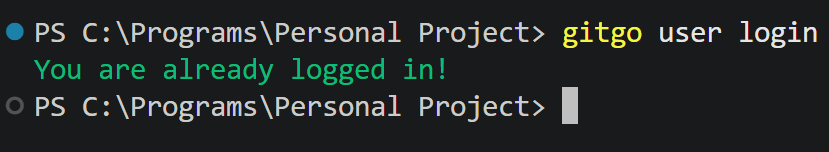
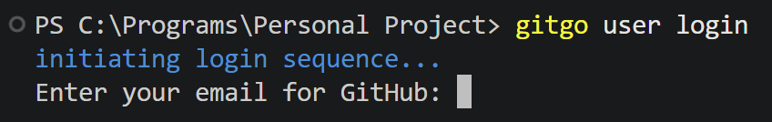
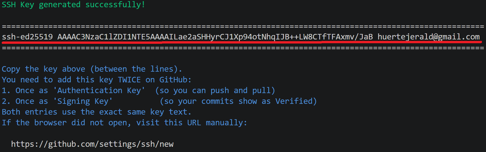
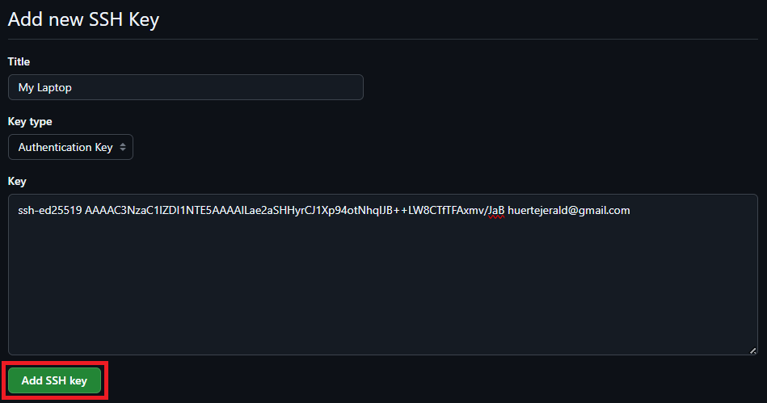
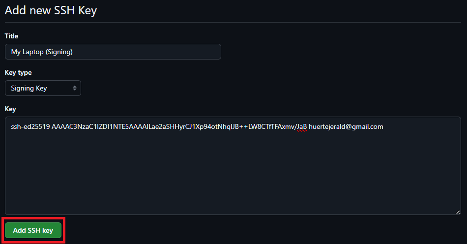
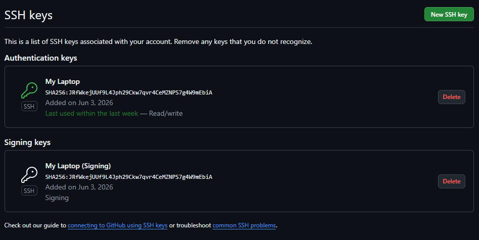
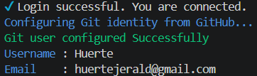

# Login Guide: `gitgo user login`

This guide helps you connect GitGo to your GitHub account. You only need to do this **once** on each computer you use.

---

## Before You Start

Make sure you have:

- GitGo installed. Run `gitgo -r` to check. It should not show any errors.
- A GitHub account. If you don't have one, create it at [github.com](https://github.com).
- OpenSSH installed. On most computers, this is already there by default.

---

## What Happens When You Run the Command

GitGo does these things for you:

1. Creates an SSH key using your email address
2. Loads the key so your computer can use it
3. Shows you the key to copy
4. Opens your GitHub page where you can add the key
5. Waits for you to come back and press Enter
6. Tests if the connection is working

You will add the same key **twice** on GitHub. One for logging in (Authentication), and one so your commits show a **Verified** badge (Signing). Both use the exact same key text.

---

## Step-by-Step

### Step 1: Run the command

Open your terminal and run:

```bash
gitgo user login
```

If you are already connected to GitHub, GitGo will tell you right away and stop. You don't need to do anything else.



> *If you see this, you're already connected. Jump to [Troubleshooting](#troubleshooting) if something feels wrong.*

---

### Step 2: Type your GitHub email

GitGo will ask for your email address.

```
Enter your email for GitHub: you@example.com
```



Type the same email you used when you signed up on GitHub. Then press Enter. GitGo checks that it looks like a real email before moving on.

---

### Step 3: Copy the key that appears

After GitGo creates your SSH key, it prints it in the terminal.


> *The key is the line between the two rows of equal signs.*

Select and copy the line that starts with `ssh-ed25519`. Include your email at the end. Do not copy the `===` lines, just the key line itself.

---

### Step 4: Add the key on GitHub (Authentication)

GitGo opens a GitHub page in your browser. It goes directly to the **Add new SSH key** form.

Fill in the form like this:

| Field | What to put |
|-------|-------------|
| **Title** | *(Optional)* A short name so you remember which computer this is. For example: `My Laptop` |
| **Key type** | Choose **Authentication Key** |
| **Key** | Paste the key you copied in Step 3 |

Then click **Add SSH key**.


> *Make sure Key type is set to Authentication Key before clicking Add SSH key.*

---

### Step 5: Add the same key again (Signing)

Go back to your GitHub SSH settings page. Click **New SSH key** again.

> This is a second entry. You are adding the **same key** one more time, but with a different type.

Fill in the form like this:

| Field | What to put |
|-------|-------------|
| **Title** | *(Optional)* Same name with a note. For example: `My Laptop (Signing)` |
| **Key type** | Choose **Signing Key** |
| **Key** | Paste the same key again |

Then click **Add SSH key**.


> *This time Key type is Signing Key. Same key text, different type.*

When both are added, your GitHub SSH keys list will show two entries with the same key fingerprint. That's normal.



---

### Step 6: Go back to the terminal and press Enter

Switch back to your terminal. GitGo is still waiting for you.


Once you added **both keys** on GitHub, press **Enter**.

---

### Step 7: Done

GitGo tests the connection. If everything is correct, you will see a success message.



GitGo also sets up your Git name and email using your GitHub account. You are ready to use `gitgo link`, `gitgo push`, and all other commands.

---

## Troubleshooting

If you see `Login Failed. The SSH key may not have been added to GitHub correctly.`, check these things one by one:

**Did you add both keys?**
Go to [github.com/settings/keys](https://github.com/settings/keys) and check. You should see two entries with the same fingerprint, one Authentication and one Signing. If one is missing, add it again using the steps above.

**Did you paste the full key?**
The key must start with `ssh-ed25519` and end with your email. If you accidentally included the `===` lines or missed part of the key, delete the entry on GitHub and add it again with the correct text.

**Is the SSH agent running?**
The key needs to be loaded into `ssh-agent` to work. Run this in your terminal:

```bash
eval $(ssh-agent) && ssh-add
```

Then run `gitgo user login` again.

**Is your network blocking SSH?**
Some office or school networks block SSH connections. Try a different network like your phone's hotspot. To test the connection manually, run:

```bash
ssh -T git@github.com
```

If it works, you will see something like: `Hi username! You've successfully authenticated...`

---

## Logging Out

To remove your SSH keys and Git identity from this computer:

```bash
gitgo user logout
```

---

*Back to [README](../README.md)*
