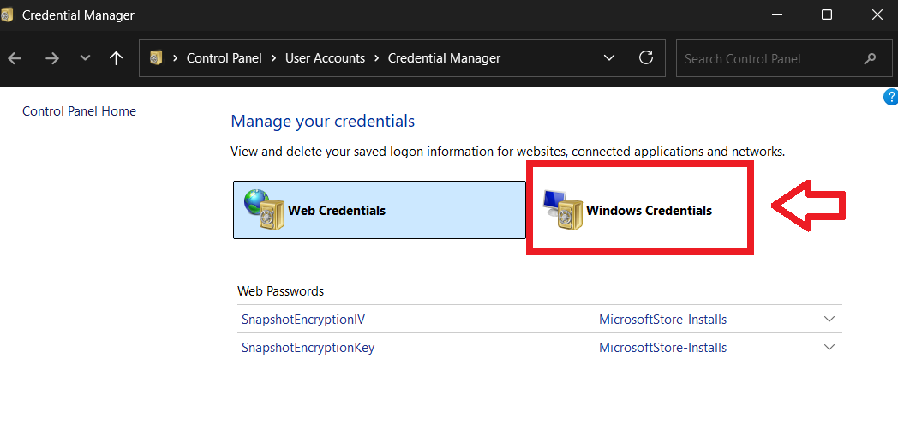
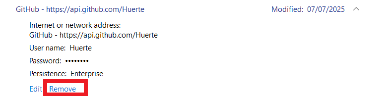

# Troubleshooting

This page covers the most common problems when setting up or using GitGo and Git. Each section shows the exact error, explains what caused it, and walks through the fix step by step.

Every section covers Windows, macOS, Linux, and Termux (Android). Follow the instructions for your platform.

If your issue isn't listed here, go to [Nothing worked](#nothing-worked) at the bottom of this page.

---

## How to find your issue

Find your symptom in the table below and jump straight to that section.

| What you're seeing | Go to |
|---|---|
| Typed `gitgo` and got "command not found" | [`gitgo` command not found](#gitgo-command-not-found) |
| Typed `git` and got "command not found" | [`git` command not found](#git-command-not-found) |
| `pip install pygitgo` failed with a Python version error | [pip install fails due to Python version](#pip-install-fails-due-to-python-version) |
| "Permission denied (publickey)" when pushing or pulling | [Permission denied (publickey)](#permission-denied-publickey) |
| "Author identity unknown" when committing | [Author identity unknown](#author-identity-unknown) |
| Push fails with "Invalid username or password", or Git asks for a password | [Old credentials blocking pushes](#old-credentials-blocking-pushes) |
| "Could not open a connection to your authentication agent" | [SSH agent not running](#ssh-agent-not-running) |
| Push or pull hangs for a long time and then times out | [Port 22 blocked by your network](#port-22-blocked-by-your-network) |
| None of the above | [Nothing worked](#nothing-worked) |

---

## Which OS are you on?

Not sure which instructions to follow? Here's how to check.

**Windows:** Press `Win + R`, type `cmd`, hit Enter. Run `ver`. If you see `Microsoft Windows [Version ...]`, you're on Windows.

**macOS:** Open Terminal (press `Cmd + Space`, search "Terminal"). Run `uname`. If it says `Darwin`, you're on macOS.

**Linux:** Open your terminal. Run `uname`. If it says `Linux`, you're on Linux.

**Termux (Android):** If you're using the Termux app on Android, follow the Linux instructions unless a Termux-specific note is shown.

---

## `gitgo` command not found

**What you see:**

```
gitgo: command not found
```

On Windows:

```
'gitgo' is not recognized as an internal or external command
```

**What happened:**

GitGo installed correctly, but the folder where Python puts command-line tools isn't in your PATH. PATH is a list of folders your terminal checks when you type a command name. If that folder isn't on the list, the terminal can't find `gitgo` even though it's installed.

---

### Windows

**Step 1.** Find where pip installed GitGo:

```bash
pip show pygitgo
```

Look for the line starting with `Location:`. It will look like:

```
Location: C:\Users\YourName\AppData\Local\Programs\Python\Python311\Lib\site-packages
```

**Step 2.** The `gitgo` command lives in a `Scripts` folder one level above `Lib`. Take the path from Step 1 and replace `Lib\site-packages` with `Scripts`. Using the example above, the result is:

```
C:\Users\YourName\AppData\Local\Programs\Python\Python311\Scripts
```

**Step 3.** Open Environment Variables:

1. Press `Win + S`
2. Type **Environment Variables**
3. Click **Edit the system environment variables**
4. Click **Environment Variables** at the bottom of the window

**Step 4.** In the top section (User variables), find **Path** and click **Edit**.

**Step 5.** Click **New** and paste the Scripts path from Step 2.

**Step 6.** Click **OK** on all open windows.

**Step 7.** Close your terminal completely and open a new one.

**Step 8.** Verify it works:

```bash
gitgo -r
```

---

### macOS

**Step 1.** Find where pip installed it:

```bash
pip show pygitgo
```

The `gitgo` binary is usually placed in `~/.local/bin` or `/usr/local/bin`.

**Step 2.** Check which shell you're using:

```bash
echo $SHELL
```

If it ends in `zsh` (default on macOS Catalina and newer), use `.zshrc`. If it ends in `bash`, use `.bashrc`.

**Step 3.** Add the bin folder to your PATH. Replace `.zshrc` with `.bashrc` if needed:

```bash
echo 'export PATH="$HOME/.local/bin:$PATH"' >> ~/.zshrc
source ~/.zshrc
```

**Step 4.** Verify it works:

```bash
gitgo -r
```

---

### Linux

**Step 1.** Find where pip installed it:

```bash
pip show pygitgo
```

The `gitgo` binary is usually placed in `~/.local/bin`.

**Step 2.** Add it to your PATH:

```bash
echo 'export PATH="$HOME/.local/bin:$PATH"' >> ~/.bashrc
source ~/.bashrc
```

**Step 3.** Verify it works:

```bash
gitgo -r
```

---

### Termux (Android)

**Step 1.** Find where pip installed it:

```bash
pip show pygitgo
```

In Termux, installed binaries usually land in `$PREFIX/bin`, which is already in PATH. If `gitgo` still isn't found:

**Step 2.** Add the bin path explicitly:

```bash
echo 'export PATH="$PREFIX/bin:$PATH"' >> ~/.bashrc
source ~/.bashrc
```

**Step 3.** Verify it works:

```bash
gitgo -r
```

---

### Still not working?

Try running `gitgo` using the full path that `pip show pygitgo` gave you. If that works, the issue is definitely PATH. Make sure you opened a new terminal window after making the change. If `pip show pygitgo` returns nothing, GitGo didn't install at all. Run `pip install pygitgo` again.

---

## `git` command not found

**What you see:**

```
git: command not found
```

On Windows:

```
'git' is not recognized as an internal or external command
```

**What happened:**

Git isn't installed on your computer, or the installer didn't add it to PATH.

---

### Windows

**Step 1.** Go to [git-scm.com](https://git-scm.com) and download the Windows installer.

**Step 2.** Run the installer. When it asks about PATH, select **Git from the command line and also from 3rd-party software**. Keep all other defaults.

**Step 3.** Close your terminal completely and open a new one.

**Step 4.** Verify:

```bash
git --version
```

You should see something like `git version 2.44.0`.

---

### macOS

**Option A: Install via Xcode Command Line Tools (no extra tools needed)**

```bash
xcode-select --install
```

A popup will appear. Click **Install** and wait. Git is included in the package.

**Option B: Install via Homebrew (if you have it)**

```bash
brew install git
```

**Verify:**

```bash
git --version
```

---

### Linux

**Debian/Ubuntu:**

```bash
sudo apt-get update && sudo apt-get install git -y
```

**Fedora/RHEL/CentOS:**

```bash
sudo dnf install git -y
```

**Arch:**

```bash
sudo pacman -S git
```

**Verify:**

```bash
git --version
```

---

### Termux (Android)

```bash
pkg update && pkg install git
```

**Verify:**

```bash
git --version
```

---

### Still not working?

If you just installed Git and still get "command not found," close your terminal and open a fresh one. The terminal needs to restart to pick up the PATH change. On Windows, if the problem continues, re-run the Git installer and make sure you select the PATH option mentioned in Step 2 above.

**External resources:**
- [Git Downloads](https://git-scm.com/downloads) (official installers for all platforms)
- [Git installation guide](https://git-scm.com/book/en/v2/Getting-Started-Installing-Git) (detailed instructions per OS)

---

## pip install fails due to Python version

**What you see:**

```
ERROR: Package 'pygitgo' requires a different Python: 3.7.x not in '>=3.8'
```

Or:

```
pip: command not found
```

**What happened:**

GitGo requires Python 3.8 or newer. Your system is running an older version, or Python isn't installed at all.

---

### Step 1: Check your current Python version

```bash
python --version
```

On some systems you may need:

```bash
python3 --version
```

If neither works, Python isn't installed.

---

### Step 2: Install or update Python

**Windows:**

1. Go to [python.org/downloads](https://www.python.org/downloads/) and download the latest version.
2. Run the installer.
3. On the first screen, check **Add Python to PATH** before clicking Install. This box is unchecked by default. If you miss it, your terminal won't be able to find Python.

**macOS:**

Option A: Download from [python.org/downloads](https://www.python.org/downloads/).

Option B (via Homebrew):

```bash
brew install python
```

**Linux (Debian/Ubuntu):**

```bash
sudo apt-get update && sudo apt-get install python3 python3-pip -y
```

**Linux (Fedora/RHEL/CentOS):**

```bash
sudo dnf install python3 python3-pip -y
```

**Termux:**

```bash
pkg install python
```

---

### Step 3: Confirm the version

Close your terminal, open a new one, then run:

```bash
python3 --version
```

It should show 3.8 or higher.

---

### Step 4: Install GitGo

```bash
pip install pygitgo
```

If `pip` doesn't work, try:

```bash
pip3 install pygitgo
```

---

### Step 5: Verify

```bash
gitgo -r
```

---

### Still not working?

If you have multiple Python versions installed, `pip` and `python` might not be pointing to the same one. Run `pip --version` and check the path shown. It should mention Python 3.8 or higher. If it references an older version, use `pip3` instead of `pip` when installing.

**External resources:**
- [Python Downloads](https://www.python.org/downloads/) (official installers)
- [Python on Windows FAQ](https://docs.python.org/3/faq/windows.html) (covers PATH issues in detail)
- [pip installation guide](https://pip.pypa.io/en/stable/installation/) (if pip itself is missing)

---

## Permission denied (publickey)

**What you see:**

```
git@github.com: Permission denied (publickey).
fatal: Could not read from remote repository.
```

**What happened:**

Git tried to connect to GitHub using SSH, but GitHub didn't accept the key. This usually means one of three things:

- You haven't run `gitgo user login` yet
- The SSH key was deleted from GitHub
- The SSH agent stopped holding the key in memory

---

### Step 1: If you haven't logged in yet

This is the most common cause. Run:

```bash
gitgo user login
```

GitGo will generate an SSH key and add it to your GitHub account. Follow the steps it shows. This works on all platforms including Termux.

---

### Step 2: Check if your key is still on GitHub

Go to [github.com/settings/keys](https://github.com/settings/keys). You should see at least two entries (one Authentication Key and one Signing Key) with the same fingerprint.

If the list is empty or the entries are missing, run `gitgo user login` again to generate new ones.

---

### Step 3: Test the SSH connection directly

```bash
ssh -T git@github.com
```

A working connection responds with:

```
Hi username! You've successfully authenticated, but GitHub does not provide shell access.
```

If you still see `Permission denied` after confirming your keys are on GitHub, delete all existing GitGo key entries at [github.com/settings/keys](https://github.com/settings/keys) and run `gitgo user login` again to start fresh.

---

### Step 4: Check the SSH agent

If Step 3 fails and your keys are on GitHub, the SSH agent might not be running. Go to [SSH agent not running](#ssh-agent-not-running), fix it, then come back and run Step 3 again.

---

### Still not working?

Check that your remote URL is using SSH and not HTTPS:

```bash
git remote -v
```

The URL should start with `git@github.com:`, not `https://`. If it starts with `https://`, switch it to SSH:

```bash
git remote set-url origin git@github.com:YourUsername/your-repo.git
```

---

## Author identity unknown

**What you see:**

```
Author identity unknown

*** Please tell me who you are.

Run

  git config --global user.email "you@example.com"
  git config --global user.name "Your Name"
```

**What happened:**

Every Git commit records who made it. Git found no name or email configured, so it stopped before creating the commit.

---

### Option A: Fix it with GitGo (recommended, works on all platforms)

```bash
gitgo user login
```

GitGo sets your name and email automatically from your GitHub account at the end of the login flow.

---

### Option B: Set it manually

Run these two commands with your own details:

```bash
git config --global user.email "your-email@example.com"
git config --global user.name "Your Name"
```

Use the same email that's on your GitHub account. The `--global` flag means this applies to every repo on your computer.

---

### Verify

Confirm Git saved the values:

```bash
git config --global user.email
git config --global user.name
```

Both should print what you just set. Then try your original command again.

---

### Still not working?

The repo might have a local config that overrides the global one. Check with:

```bash
git config user.email
git config user.name
```

If those return different or empty values, set them for this specific repo (run inside the repo folder, without `--global`):

```bash
git config user.email "your-email@example.com"
git config user.name "Your Name"
```

---

## Old credentials blocking pushes

**What you see:**

A password prompt when you run `git push`, or a failure like:

```
remote: Invalid username or password.
fatal: Authentication failed for 'https://github.com/...'
```

**What happened:**

Your system stored old GitHub credentials (a username and password) and sends them automatically when Git contacts GitHub. GitHub stopped accepting passwords for Git operations in August 2021. Those saved credentials always fail now. You need to clear them and switch to SSH.

---

### Windows

**Step 1: Confirm Windows Credential Manager is active**

```bash
git config --global credential.helper
```

If the output is `manager` or `manager-core`, Credential Manager is storing the old credentials.

**Step 2: Open Credential Manager**

1. Press `Win + S`
2. Type **Credential Manager** and open it
3. Click the **Windows Credentials** tab 

**Step 3: Remove GitHub entries**

Look for entries named like:

- `git:https://github.com`
- `github.com`
- `git:https://api.github.com`

For each one you find:

1. Click the entry to expand it
2. Click **Remove** 
3. Confirm when the dialog appears

Repeat for every GitHub-related entry.

**Step 4: Switch to SSH**

```bash
gitgo user login
```

Follow the [Login Guide](login-guide.md) if you haven't done this yet. After that, pushes and pulls won't ask for a password.

---

### macOS

**Step 1: Confirm the credential helper**

```bash
git config --global credential.helper
```

If it says `osxkeychain`, macOS Keychain is storing the old credentials.

**Step 2: Remove the stored credentials**

Open **Keychain Access** (press `Cmd + Space` and search for "Keychain Access"). Search for `github.com`. Delete any entries you find.

Alternatively, run this in your terminal:

```bash
git credential-osxkeychain erase
```

When prompted, type the following exactly, then press Enter twice:

```
host=github.com
protocol=https
```

**Step 3: Switch to SSH**

```bash
gitgo user login
```

---

### Linux

**Step 1: Confirm the credential helper**

```bash
git config --global credential.helper
```

**Step 2: Clear the credentials based on what the helper shows**

If it says `store`, credentials are saved in plaintext at `~/.git-credentials`. Open that file:

```bash
nano ~/.git-credentials
```

Delete any lines that contain `github.com`. Save with `Ctrl + O`, exit with `Ctrl + X`.

If it says `libsecret` or `gnome-libsecret`, run:

```bash
git credential reject
```

Type the following, then press Enter twice:

```
host=github.com
protocol=https
```

**Step 3: Switch to SSH**

```bash
gitgo user login
```

---

### Termux (Android)

Termux doesn't use a credential manager by default. If you're hitting this error, you're likely using an HTTPS remote URL.

**Step 1: Check your remote URL**

```bash
git remote -v
```

**Step 2: Switch to SSH if the URL starts with `https://`**

```bash
git remote set-url origin git@github.com:YourUsername/your-repo.git
```

**Step 3: Set up SSH keys if you haven't yet**

```bash
gitgo user login
```

---

### Verify (all platforms)

Try the push again:

```bash
git push
```

It should complete without asking for a password.

---

## SSH agent not running

**What you see:**

```
Could not open a connection to your authentication agent.
```

Or:

```
Error connecting to agent: No such file or directory
```

**What happened:**

The SSH agent is a background process that holds your SSH key in memory while your computer is on. Without it, Git can't use the key to authenticate. It either stopped after a reboot or was never started.

---

### Windows

**Step 1.** Open PowerShell as Administrator.

Right-click the Start button and choose **Windows PowerShell (Admin)** or **Terminal (Admin)**.

**Step 2.** Run:

```powershell
Set-Service ssh-agent -StartupType Automatic
Start-Service ssh-agent
```

The first line tells Windows to auto-start the agent every time you log in. The second line starts it right now without a reboot.

**Step 3.** Close PowerShell and try your original command again.

---

### macOS

macOS manages the SSH agent automatically. If you're still seeing this error, run:

```bash
eval "$(ssh-agent -s)"
```

Then add your key. On macOS Monterey and newer:

```bash
ssh-add --apple-use-keychain ~/.ssh/id_ed25519
```

On older macOS versions, use `-K` instead:

```bash
ssh-add -K ~/.ssh/id_ed25519
```

The Keychain flag saves the key passphrase so you don't need to re-add the key after every reboot.

---

### Linux

```bash
eval $(ssh-agent -s)
ssh-add ~/.ssh/id_ed25519
```

On most Linux desktop environments, the SSH agent starts automatically when you log in. If it doesn't on your setup, add these lines to your `~/.bashrc` to start it automatically:

```bash
if [ -z "$SSH_AUTH_SOCK" ]; then
  eval $(ssh-agent -s)
  ssh-add ~/.ssh/id_ed25519
fi
```

Then run `source ~/.bashrc` to apply it immediately.

---

### Termux (Android)

```bash
eval $(ssh-agent -s)
ssh-add ~/.ssh/id_ed25519
```

The SSH agent doesn't persist across Termux sessions. To make it start automatically every time you open Termux, add this to `~/.bashrc`:

```bash
echo 'if [ -z "$SSH_AUTH_SOCK" ]; then eval $(ssh-agent -s) && ssh-add ~/.ssh/id_ed25519 2>/dev/null; fi' >> ~/.bashrc
```

---

### Verify

Test the connection to GitHub:

```bash
ssh -T git@github.com
```

A working response:

```
Hi username! You've successfully authenticated, but GitHub does not provide shell access.
```

---

### Still not working?

Make sure the key file path is correct. If GitGo generated your keys, they're usually at `~/.ssh/id_ed25519`. Confirm they exist:

```bash
ls ~/.ssh/
```

If you don't see `id_ed25519` and `id_ed25519.pub`, run `gitgo user login` to generate new keys.

**External resources:**
- [GitHub: Generating a new SSH key](https://docs.github.com/en/authentication/connecting-to-github-with-ssh/generating-a-new-ssh-key-and-adding-it-to-the-ssh-agent) (official step-by-step from GitHub)
- [GitHub: Working with the SSH agent](https://docs.github.com/en/authentication/connecting-to-github-with-ssh/generating-a-new-ssh-key-and-adding-it-to-the-ssh-agent#adding-your-ssh-key-to-the-ssh-agent)

---

## Port 22 blocked by your network

**What you see:**

```
ssh: connect to host github.com port 22: Connection timed out
fatal: Could not read from remote repository.
```

**What happened:**

SSH normally connects on port 22. Some networks (office, school, hotel, public wifi) block this port. The command hangs because it can't reach GitHub, then gives up after a timeout.

GitHub also accepts SSH connections over port 443, which is the port used for regular HTTPS traffic. Most networks keep port 443 open.

---

### Step 1: Confirm port 22 is blocked

```bash
ssh -T git@github.com
```

If it hangs for about 30 seconds and then times out, port 22 is blocked.

---

### Step 2: Test if port 443 works

```bash
ssh -T -p 443 git@ssh.github.com
```

If you see:

```
Hi username! You've successfully authenticated, but GitHub does not provide shell access.
```

Port 443 works on your network. Continue to Step 3.

If this also times out, your network is blocking all external SSH. Try switching to a mobile hotspot or a different network.

---

### Step 3: Configure SSH to always use port 443 for GitHub

Open (or create) the SSH config file for your platform:

**Windows:** `C:\Users\YourName\.ssh\config` (no file extension, just `config`)

**macOS / Linux / Termux:** `~/.ssh/config`

---

**Windows:**

Open Notepad and navigate to `C:\Users\YourName\.ssh\`. If `config` doesn't exist, create a new file there. Add:

```
Host github.com
  Hostname ssh.github.com
  Port 443
  User git
```

Save it as `config` with no file extension. Confirm Notepad didn't add `.txt` by enabling "Show file name extensions" in File Explorer under View settings. If it shows `config.txt`, rename it and remove the `.txt` part.

---

**macOS, Linux, and Termux:**

```bash
nano ~/.ssh/config
```

Add:

```
Host github.com
  Hostname ssh.github.com
  Port 443
  User git
```

Save with `Ctrl + O`, exit with `Ctrl + X`.

---

### Step 4: Verify

```bash
ssh -T git@github.com
```

It should now connect through port 443 and show the success message.

---

### Still not working?

On Windows, double-check that the config file has no `.txt` extension. On all platforms, make sure the indentation in the config file uses spaces, not tabs, and that there's no trailing whitespace. Even a small formatting mistake can cause SSH to ignore the config.

**External resources:**
- [GitHub: Using SSH over the HTTPS port](https://docs.github.com/en/authentication/troubleshooting-ssh/using-ssh-over-the-https-port) (official GitHub guide for this exact problem)

---

## Nothing worked

If you've gone through the relevant section and still have the same problem, open a Bug Report on GitHub. The issue template will prompt you for your environment details (like your OS and Python version) and the exact error output.

> **Note:** If you are reporting a security problem, please do NOT open a bug report. See [SECURITY.md](../SECURITY.md) instead.

More detail means a faster fix. Don't just paste the last error line in the issue body. The lines before it often show the real cause.

**Open an issue here:** [github.com/Huerte/GitGo/issues](https://github.com/Huerte/GitGo/issues)

---

*Back to [README](../README.md) | [Login Guide](login-guide.md) | [First Contribution](first-contribution.md)*